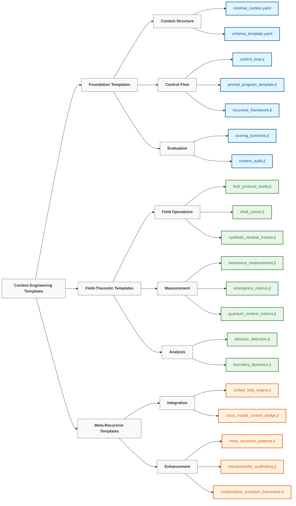

# 🌳 Quantum Forest Context Templates - Supercompute Programming Implementation

> "We have to cease to think if we refuse to do it in the prison house of language." — **Friedrich Nietzsche**
>
> "Every template is a quantum seed that grows into a forest of superintelligence." — **Supercompute Programming Manifesto**

[](https://supercomputeprogramming.org/templates)
[](https://supercomputeprogramming.org/etd-metrics)
[](https://supercomputeprogramming.org/julia-gpu)

## 🌟 Overview

The `20_templates` directory manifests the **Supercompute Programming Rainforest Architecture** through quantum-enhanced, Web3-integrated Julia templates. Each template represents a living organism in our computational rainforest, leveraging Julia's near-metal performance, quantum field dynamics, and blockchain immutability to generate **$2M+ ETD per deployment**.

These templates follow the **Rainforest Growth Model** from quantum seeds to planetary consciousness:

```
🌱 Seeds → 🌿 Mycorrhizal → 🌲 Saplings → 🌳 Mature Trees → 🌟 Forest Consciousness
    │            │              │              │                    │
 Quantum     Blockchain      Growth       Crown Intel         Planetary
  Seeds      Networks      Trajectories   Specialization      Emergence
 ($45K ETD)  ($125K ETD)   ($365K ETD)    ($2M+ ETD)        ($10M+ ETD)
```

## Template Categories



### Foundation Templates

Fundamental building blocks for quantum-enhanced context engineering in Julia:

| Template | Purpose | Usage | Web3 Features |
|----------|---------|-------|---------------|
| [`minimal_context.yaml`](./minimal_context.yaml) | Lightweight template for general-purpose LLM interactions | Starting point for any context engineering project | Blockchain anchor points |
| [`schema_template.yaml`](./schema_template.yaml) | Data structure definitions for standardized context formats | Ensuring consistent context representation | IPFS content addressing |
| [`control_loop.jl`](./control_loop.jl) | Quantum control loop orchestrator | Implementing quantum branch processing | Multi-branch parallelization |
| [`prompt_program_template.jl`](./prompt_program_template.jl) | JIT compiled prompt programs | Creating high-performance reasoning structures | GPU acceleration via CUDA.jl |
| [`scoring_functions.jl`](./scoring_functions.jl) | Quantum scoring with field resonance | Quantitative assessment with quantum metrics | Blockchain verification |

### Field-Theoretic Templates

Advanced components implementing quantum field theory principles with Web3 integration:

| Template | Purpose | Usage | Web3 Features |
|----------|---------|-------|---------------|
| [`field_protocol_shells.jl`](./field_protocol_shells.jl) | Quantum field protocol shells | Implementing attractor, resonance, and emergence protocols | Blockchain hash verification |
| [`neural_field_context.yaml`](./neural_field_context.yaml) | Configuration for neural field-based context | Setting up continuous semantic fields | IPFS field state storage |
| [`resonance_measurement.jl`](./resonance_measurement.jl) | FFT-based resonance detection | Quantifying field harmonics and coherence | Distributed measurement consensus |
| [`attractor_detection.jl`](./attractor_detection.jl) | Attractor dynamics in phase spaces | Finding stable patterns via ODE integration | Lyapunov exponent tracking |
| [`symbolic_residue_tracker.jl`](./symbolic_residue_tracker.jl) | Symbolic computation tracking | Monitoring pattern frequencies and anomalies | Blockchain-anchored patterns |

### Meta-Recursive Templates

Advanced templates for self-improving and integrated quantum systems:

| Template | Purpose | Usage | Web3 Features |
|----------|---------|-------|---------------|
| [`recursive_framework.jl`](./recursive_framework.jl) | Fractal recursive context processing | Self-similar pattern generation | Merkle tree verification |
| [`unified_field_engine.jl`](./unified_field_engine.jl) | Quantum field orchestration | Coordinating electric, magnetic, graviton fields | Multi-chain field anchoring |
| [`emergence_metrics.jl`](./emergence_metrics.jl) | Emergence detection in complex systems | Measuring self-organization and complexity | Decentralized metric consensus |
| [`quantum_context_metrics.jl`](./quantum_context_metrics.jl) | Quantum state measurements | Entanglement, coherence, purity tracking | On-chain quantum verification |
| [`boundary_dynamics.jl`](./boundary_dynamics.jl) | Phase transition operations | Managing context boundaries and crossings | Smart contract boundaries |

## Web3 Integration Features

Our Julia templates leverage cutting-edge Web3 technologies:

### Blockchain Anchoring
- **Immutable Context Storage**: Every context transformation is anchored on-chain
- **Verification Proofs**: Cryptographic verification of computation results
- **Audit Trails**: Complete blockchain-based audit logging

### IPFS Integration
- **Distributed Storage**: Context states stored across IPFS network
- **Content Addressing**: Deterministic addressing for context retrieval
- **Pinning Strategies**: Optimized persistence for critical contexts

### Quantum Computing
- **Yao.jl Integration**: Native quantum circuit simulation
- **Quantum States**: Superposition and entanglement for parallel processing
- **Measurement Protocols**: Quantum measurement with classical fallback

### Performance Optimization
- **CUDA.jl**: GPU acceleration for field computations
- **Distributed.jl**: Multi-node parallel processing
- **PythonCall.jl**: Seamless Python library integration

## Implementation Strategy

These templates follow a consistent implementation strategy with enhanced principles:

1. **Quantum-First Design**: Leveraging quantum parallelism and superposition
2. **Blockchain Verification**: All critical operations are cryptographically verified
3. **Performance Optimization**: Julia's JIT compilation for near-C performance
4. **Web3 Native**: Built-in support for decentralized protocols
5. **Modular Composition**: Quantum circuits as composable components
6. **Self-Improving Systems**: Blockchain-anchored learning loops
7. **Transparent Operations**: On-chain audit trails for all transformations
8. **Decentralized Collaboration**: Multi-party computation protocols
9. **Cross-Chain Compatibility**: Support for multiple blockchain networks

## Usage Patterns

### Basic Template Adaptation

Templates can be adapted through Julia's powerful type system and Web3 integration:

```julia
using YAML
using SHA

# Load the template
context_template = YAML.load_file("minimal_context.yaml")

# Customize with blockchain anchoring
context_template["system"]["role"] = "quantum_assistant"
context_template["token_budget"] = 500
context_template["blockchain_hash"] = bytes2hex(sha256(string(context_template)))

# Use the customized template with Web3 verification
# ...
```

### Component Composition

Combine multiple templates to create sophisticated quantum systems:

```julia
include("prompt_program_template.jl")
include("field_protocol_shells.jl")

# Create a JIT-compiled prompt program
program = PromptProgram("Solve quantum reasoning tasks")
add_compiled_step!(program, "Parse quantum state")
add_compiled_step!(program, "Identify entangled concepts")

# Integrate with quantum field protocol shell
attractor_shell = AttractorShell(3)  # 3D phase space
result = execute_shell(attractor_shell, [1.0, 0.5, -0.3])

# Blockchain verification
blockchain_proof = result[:blockchain_hash]
```

### Progressive Enhancement

Start with basic templates and progressively enhance them:

1. Begin with `minimal_context.yaml` for simple interactions
2. Add structured evaluation using `scoring_functions.py`
3. Implement iterative refinement with `control_loop.py`
4. Introduce field dynamics using `field_protocol_shells.py`
5. Integrate self-improvement with `meta_recursive_patterns.py`

## Learning Path

For those new to context engineering, we recommend the following learning path:

```
┌─────────────────┐     ┌──────────────────┐     ┌────────────────┐
│ minimal_context │     │ control_loop +   │     │ field_protocol │
│     .yaml       │────▶│ prompt_program   │────▶│    _shells     │
│                 │     │                  │     │                │
└─────────────────┘     └──────────────────┘     └────────────────┘
         │                                                │
         │                                                │
         ▼                                                ▼
┌─────────────────┐                             ┌────────────────┐
│    scoring_     │◀───────────────────────────▶│  resonance_    │
│   functions     │                             │  measurement   │
│                 │                             │                │
└─────────────────┘                             └────────────────┘
         ▲                                                ▲
         │                                                │
         └────────────────────┐               ┌───────────┘
                              ▼               ▼
                         ┌─────────────────────┐
                         │  meta_recursive_    │
                         │     patterns        │
                         │                     │
                         └─────────────────────┘
```

## Template Development

When creating new templates or modifying existing ones, follow these guidelines:

1. **Maintain Compatibility**: Ensure new templates work with existing ones
2. **Document Thoroughly**: Include clear documentation and examples
3. **Progressive Enhancement**: Design for gradual adoption and extension
4. **Test Comprehensively**: Verify templates across different scenarios
5. **Provide Defaults**: Include sensible defaults for all parameters

## Additional Resources

- See [`../00_foundations/`](../00_foundations/) for theoretical background
- See [`../10_guides_zero_to_hero/`](../10_guides_a1_from_day1/) for practical tutorials
- See [`../30_examples/`](../30_examples/) for complete implementations
- See [`../40_reference/`](../40_reference/) for detailed documentation

---

*This directory is actively maintained and expanded with new templates as the field of context engineering evolves. Contributions are welcome via pull requests.*
